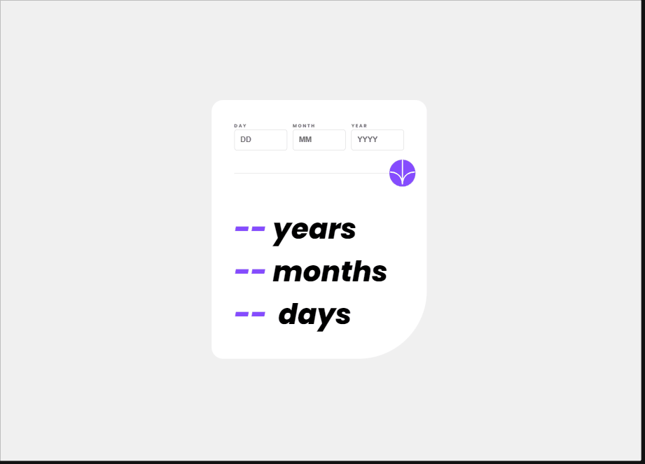

# Age-Calculator

Este desafio foi retirado do site Frontend Mentor.   [Clique aqui](https://www.frontendmentor.io/challenges/age-calculator-app-dF9DFFpj-Q) para conferi-lo.

## Resultado final:
 

## Do que se trata esse desafio?
Trata-se de uma calculadora que calcula a idade em dias, meses e anos.

## Quais validações devem ser feitas?
- O usário ao inserir uma data, é calculado e mostrado na tela a idade correspondente em dias, meses e anos.
- Caso o usuário insira um valor inválido ou deixe de preencher algum campo, uma mensagem de erro é acionada.
  
## Habilidades desenvolvidas:
- Uso de tags semânticas na construção do HTML.
- Uso de flexbox para ajustes dos elementos na tela.
- Uso e manipulação dos elementos no JavaScript.
- Uso de funções e métodos para o correto funcionamento da calculadora.
- Uso de mediaqueries para responsividade.

## Linguagens Utilizadas:
- HTML 

- CSS  

- JAVASCRIPT  
          

## Visite o projeto:
Para testar, [CLIQUE AQUI!](https://jessica-os.github.io/Age-Calculator/)

